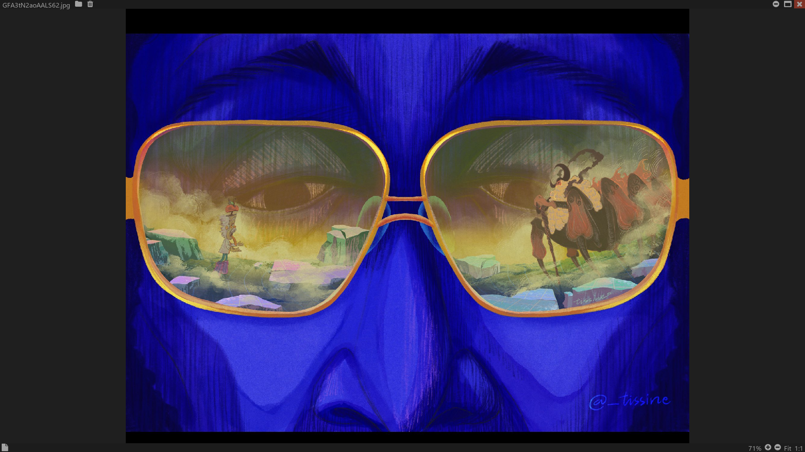

# Pix3 Image Viewer
A image viewer for Windows, written in C/C++.

## Features
  - Zoom and panning
  - File tree browser
  - Drag and drop
  - Minimal interface

## Usage
- Opening a file:
  - Drag and drop image into the application. Loads the file and reads the images contained in the file's directory.
  - Use the file tree browser, by pressing the folder icon, to open a file.
  - Command line invocation by typing: `Pix3.exe "file_path"`

## Build
Run `build.bat release`
